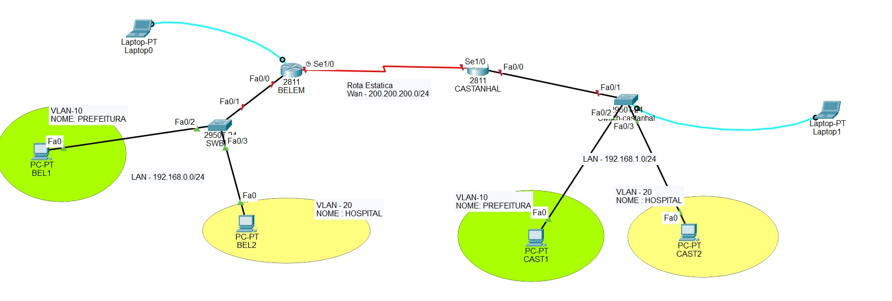

# Cisco
# Projeto Redes - Belém e Castanhal

Projeto acadêmico de interligação de duas cidades utilizando:

- VLANs
- Roteamento Estático
- ACLs

## Endereçamento

### WAN
200.200.200.0/24

### Belém - 
VLAN10: PREFEITURA - 192.168.0.0/24
VLAN20: HOSPITAL - 192.168.1.0/24

### Castanhal
VLAN10: PREFEITURA  - 192.168.2.0/24
VLAN20: HOSPITAL -  - 192.168.3.0/24

### - SEQUENCIA

- Switch
- Rotedor
- ACL No roteador

